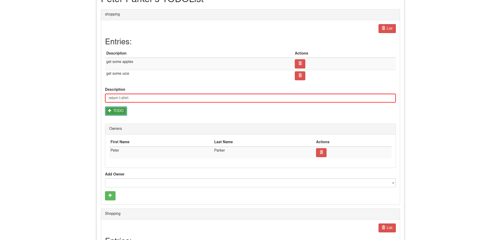

# Add List Entry

This feature is about ...

## AddListEntry

To add a list entry, first tip in the description of task in the input field,
then click the "+ TODO" button bellow or just press Enter on your keyboard.

Descriptive text about this element.

