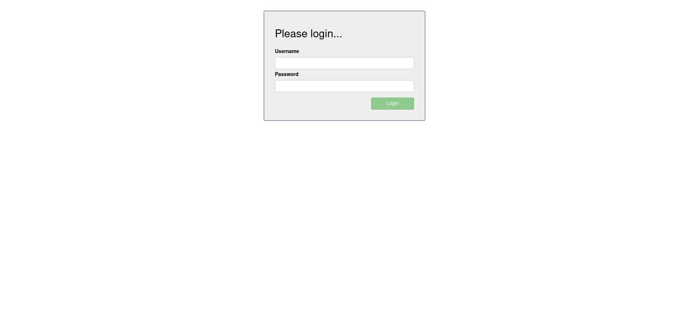

# Add List Owner

This feature is about ...

## AddListOwner

To login in go to http://localhost:8080.

|  |
| :--: |
| The application landing page is also the login interface. Username and password are required to access to the dashboard and manage the todo list. |

After you've entered the correct username and password, click the Login button to access the application dashboard.

|  |
| :--: |
| Fill in username and password. |

On the dashboard - with no todo list yet - enter a descriptive name for the new list you want to create,
and press Enter or click the "+List" button.
To add a list owner, first select an existing user in the select box,
then click the "+" button right underneath.

|  |
| :--: |
| Select an existing user from the dropdown list and click "+". |

Click on the add button located right below the select field.

