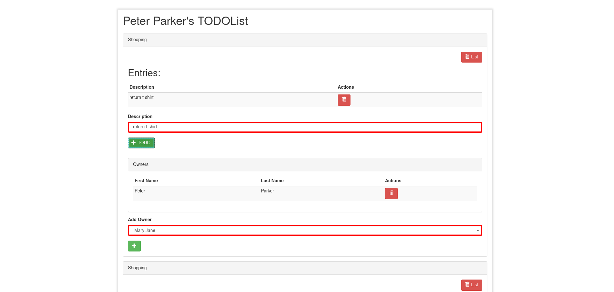

# Add List Owner

This feature is about ...

## AddListOwner

To add a list owner, first select an existing user in the select box,
then click the "+" button right underneath.

Select an existing user from the dropdown list and click "+".
Click on the add button located right below the select field.

