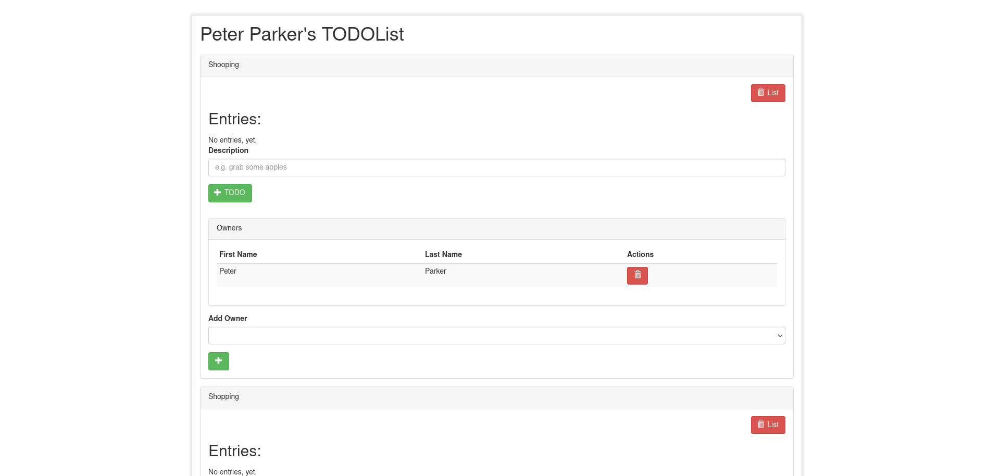

# Create New List

This feature is about creating a new todo list. After loging in you will get to the user dashboard where you manage you lists.

## CreateNewList

On the dashboard - with no todo list yet - enter a descriptive name for the new list you want to create,
and press Enter or click the "+List" button.

Creating a new todo list

A new list with no entry yet has been created.

