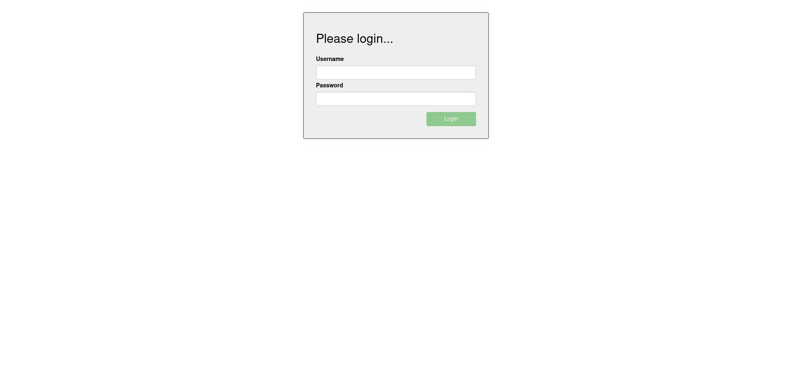

# Create New List

This feature is about creating a new todo list. After loging in you will get to the user dashboard where you manage you lists.

## CreateNewList

To login in go to http://localhost:8080.

|  |
| :--: |
| The application landing page is also the login interface. Username and password are required to access to the dashboard and manage the todo list. |

After you've entered the correct username and password, click the Login button to access the application dashboard.

|  |
| :--: |
| Fill in username and password. |

On the dashboard - with no todo list yet - enter a descriptive name for the new list you want to create,
and press Enter or click the "+List" button.

|  |
| :--: |
| Creating a new todo list |

|  |
| :--: |
| A new list with no entry yet has been created. |

