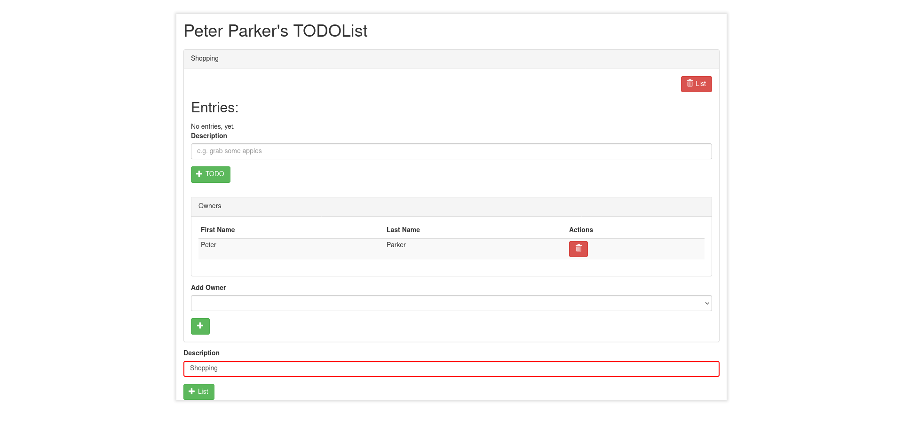

# Delete List Entry

This feature is about ...

## DeleteListEntry

A list entry is represented in a single row, showing the description and the action that can be perform on this specific list item.

Descriptive text about this element.

To remove a list item, click on the remove button located on the right of the task description.

