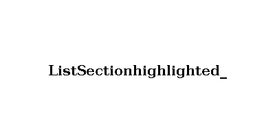

# Delete List

This feature is about ...

## DeleteList

To login in go to http://localhost:8080.
After you've entered the correct username and password, click the Login button to access the application dashboard.
On the dashboard - with no todo list yet - enter a descriptive name for the new list you want to create,
and press Enter or click the "+List" button.
A list is represented 

|  |
| :--: |
| To remove a list element, click the "Remove List" button located in the top right-hand corner of the target list section. |

