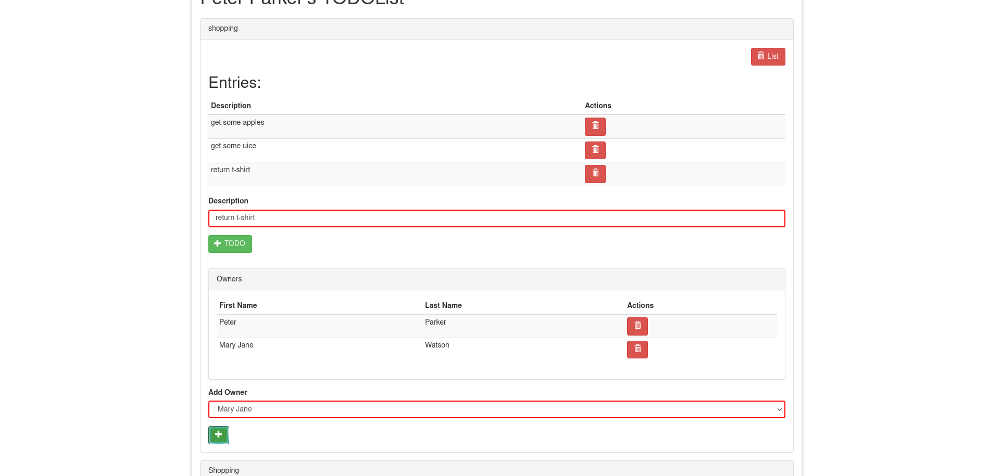

# Remove List Owner

This feature is about ...

## RemoveListOwner

A list owner is represented in a single row, showing firstname, lastname and the action that can be perform on this specific list owner.

To remove a list owner click on the red button on the right-hand side of the name.
To remove a list owner, click on the remove button located on the right-hand side of the owner lastname.

